# UML Diagrams — FoodOrderSystem

> Part of FOS-SRS-001 v0.11.2 (APPROVED 2026-11-20). Visual companion to the SRS: every diagram reflects what is built (Phases 1–14). Diagrams use [Mermaid](https://mermaid.js.org) and render on GitHub and in most Markdown viewers. Sources of truth: requirements in this folder, the Prisma schema in `packages/db/prisma/schema`, and the code in `apps/`.

## Contents

1. [Use case diagram](#1-use-case-diagram)
2. [Component diagram](#2-component-diagram)
3. [Deployment diagram](#3-deployment-diagram)
4. [Class diagrams (domain model)](#4-class-diagrams-domain-model)
5. [State machine diagrams](#5-state-machine-diagrams)
6. [Sequence diagrams](#6-sequence-diagrams)
7. [Activity diagram — checkout](#7-activity-diagram--checkout)

---

## 1. Use case diagram

Four actors use four apps; the system itself (worker and timers) acts as a fifth actor. Detailed requirement IDs are in `FUNCTIONAL-REQUIREMENTS.md`.

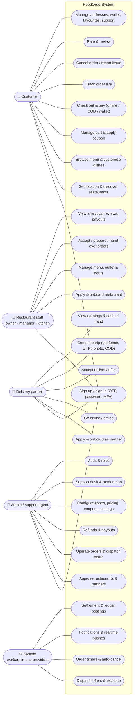
```mermaid
flowchart LR
  Customer(["👤 Customer"])
  Restaurant(["👤 Restaurant staff<br/>owner · manager · kitchen"])
  Partner(["👤 Delivery partner"])
  Admin(["👤 Admin / support agent"])
  System(["⚙️ System<br/>worker, timers, providers"])

  subgraph FOS["FoodOrderSystem"]
    direction TB
    UC1(["Sign up / sign in (OTP, password, MFA)"])
    UC2(["Set location & discover restaurants"])
    UC3(["Browse menu & customise dishes"])
    UC4(["Manage cart & apply coupon"])
    UC5(["Check out & pay (online / COD / wallet)"])
    UC6(["Track order live"])
    UC7(["Cancel order / report issue"])
    UC8(["Rate & review"])
    UC9(["Manage addresses, wallet, favourites, support"])

    UC10(["Apply & onboard restaurant"])
    UC11(["Manage menu, outlet & hours"])
    UC12(["Accept / prepare / hand over orders"])
    UC13(["View analytics, reviews, payouts"])

    UC14(["Apply & onboard as partner"])
    UC15(["Go online / offline"])
    UC16(["Accept delivery offer"])
    UC17(["Complete trip (geofence, OTP / photo, COD)"])
    UC18(["View earnings & cash in hand"])

    UC19(["Approve restaurants & partners"])
    UC20(["Operate orders & dispatch board"])
    UC21(["Refunds & payouts"])
    UC22(["Configure zones, pricing, coupons, settings"])
    UC23(["Support desk & moderation"])
    UC24(["Audit & roles"])

    UC25(["Dispatch offers & escalate"])
    UC26(["Order timers & auto-cancel"])
    UC27(["Notifications & realtime pushes"])
    UC28(["Settlement & ledger postings"])
  end

  Customer --- UC1 & UC2 & UC3 & UC4 & UC5 & UC6 & UC7 & UC8 & UC9
  Restaurant --- UC1 & UC10 & UC11 & UC12 & UC13
  Partner --- UC1 & UC14 & UC15 & UC16 & UC17 & UC18
  Admin --- UC1 & UC19 & UC20 & UC21 & UC22 & UC23 & UC24
  System --- UC25 & UC26 & UC27 & UC28
```

---

## 2. Component diagram

A modular monolith: one API process (many modules), one worker process (outbox relay, jobs, sweeps), four React apps sharing packages.

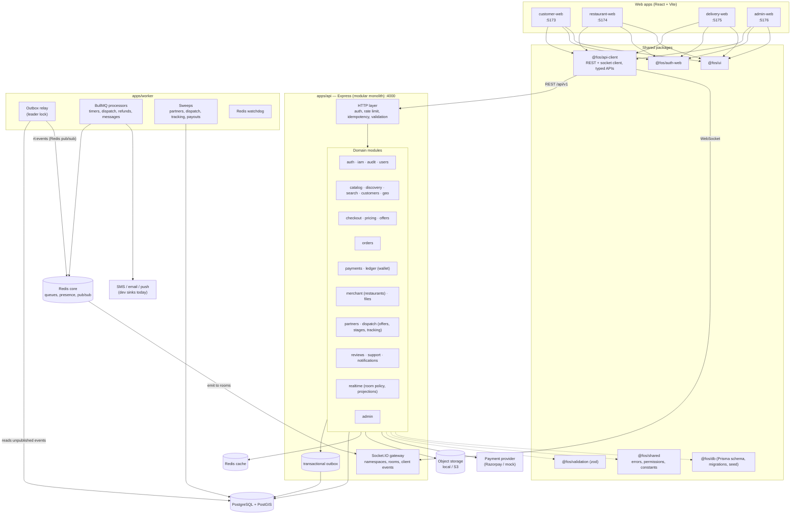
```mermaid
flowchart TB
  subgraph Clients["Web apps (React + Vite)"]
    CW["customer-web<br/>:5173"]
    RW["restaurant-web<br/>:5174"]
    DW["delivery-web<br/>:5175"]
    AW["admin-web<br/>:5176"]
  end

  subgraph Shared["Shared packages"]
    APIC["@fos/api-client<br/>REST + socket client, typed APIs"]
    AUTHW["@fos/auth-web"]
    UI["@fos/ui"]
    VAL["@fos/validation (zod)"]
    SH["@fos/shared<br/>errors, permissions, constants"]
    DB["@fos/db (Prisma schema, migrations, seed)"]
  end

  subgraph API["apps/api — Express (modular monolith) :4000"]
    direction TB
    HTTP["HTTP layer<br/>auth, rate limit, idempotency, validation"]
    GW["Socket.IO gateway<br/>namespaces, rooms, client events"]
    subgraph Modules["Domain modules"]
      M1["auth · iam · audit · users"]
      M2["catalog · discovery · search · customers · geo"]
      M3["checkout · pricing · offers"]
      M4["orders"]
      M5["payments · ledger (wallet)"]
      M6["merchant (restaurants) · files"]
      M7["partners · dispatch (offers, stages, tracking)"]
      M8["reviews · support · notifications"]
      M9["realtime (room policy, projections)"]
      M10["admin"]
    end
    OUTBOX[("transactional outbox")]
  end

  subgraph Worker["apps/worker"]
    RELAY["Outbox relay<br/>(leader lock)"]
    JOBS["BullMQ processors<br/>timers, dispatch, refunds, messages"]
    SWEEPS["Sweeps<br/>partners, dispatch, tracking, payouts"]
    WATCH["Redis watchdog"]
  end

  PG[("PostgreSQL + PostGIS")]
  RC[("Redis core<br/>queues, presence, pub/sub")]
  RCache[("Redis cache")]
  S3[("Object storage<br/>local / S3")]
  PAY["Payment provider<br/>(Razorpay / mock)"]
  MSG["SMS / email / push<br/>(dev sinks today)"]

  CW & RW & DW & AW --> APIC
  CW & RW & DW & AW --> AUTHW & UI
  APIC -->|"REST /api/v1"| HTTP
  APIC -->|"WebSocket"| GW
  HTTP --> Modules
  Modules --> OUTBOX
  Modules --> PG
  Modules --> RCache
  Modules --> S3
  Modules --> PAY
  OUTBOX --> PG
  RELAY -->|"reads unpublished events"| PG
  RELAY -->|"rt:events (Redis pub/sub)"| RC
  RC -->|"emit to rooms"| GW
  JOBS --> RC
  JOBS --> MSG
  SWEEPS --> PG
  Modules -.-> VAL & SH & DB
```

---

## 3. Deployment diagram

Production layout from `docs/guides/DEPLOYMENT.md`. Locally the same processes run on one machine (Postgres 5433, Redis 6390/6391 without Docker).

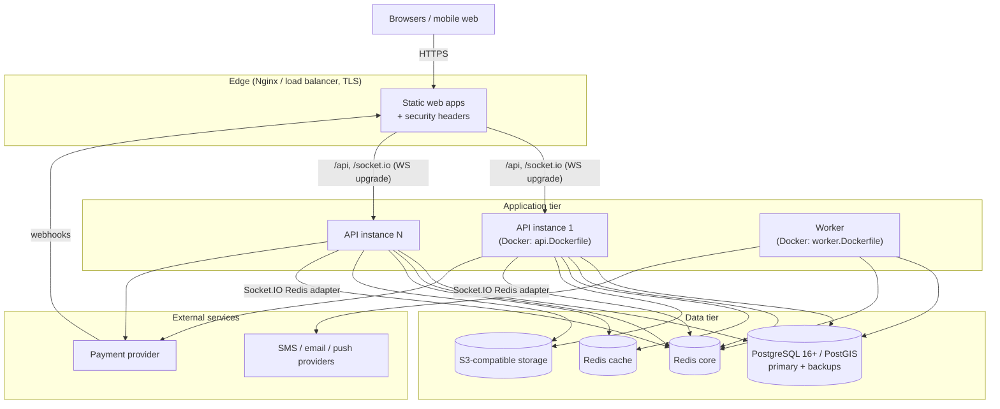
```mermaid
flowchart TB
  Browser["Browsers / mobile web"]

  subgraph Edge["Edge (Nginx / load balancer, TLS)"]
    NGINX["Static web apps<br/>+ security headers"]
  end

  subgraph AppTier["Application tier"]
    API1["API instance 1<br/>(Docker: api.Dockerfile)"]
    API2["API instance N"]
    WK["Worker<br/>(Docker: worker.Dockerfile)"]
  end

  subgraph Data["Data tier"]
    PG[("PostgreSQL 16+ / PostGIS<br/>primary + backups")]
    R1[("Redis core")]
    R2[("Redis cache")]
    OBJ[("S3-compatible storage")]
  end

  subgraph External["External services"]
    RZP["Payment provider"]
    SMS["SMS / email / push providers"]
  end

  Browser -->|"HTTPS"| NGINX
  NGINX -->|"/api, /socket.io (WS upgrade)"| API1 & API2
  API1 & API2 --> PG & R1 & R2 & OBJ
  API1 & API2 -->|"Socket.IO Redis adapter"| R1
  WK --> PG & R1
  API1 & API2 --> RZP
  RZP -->|"webhooks"| NGINX
  WK --> SMS
```

---

## 4. Class diagrams (domain model)

Key entities and relationships only (about 140 tables exist; see `docs/database/ERD.md` for every column). Money is integer paise; ids are UUID v7.

### 4.1 Identity and access

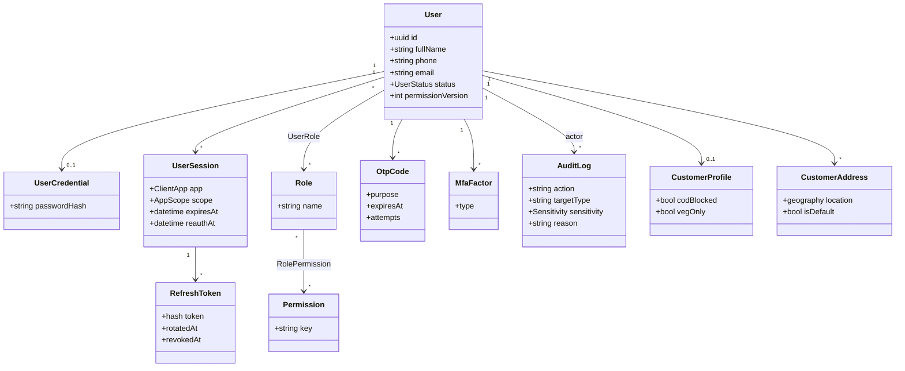
```mermaid
classDiagram
  class User {
    +uuid id
    +string fullName
    +string phone
    +string email
    +UserStatus status
    +int permissionVersion
  }
  class UserCredential {
    +string passwordHash
  }
  class UserSession {
    +ClientApp app
    +AppScope scope
    +datetime expiresAt
    +datetime reauthAt
  }
  class RefreshToken {
    +hash token
    +rotatedAt
    +revokedAt
  }
  class Role {
    +string name
  }
  class Permission {
    +string key
  }
  class OtpCode {
    +purpose
    +expiresAt
    +attempts
  }
  class MfaFactor {
    +type
  }
  class AuditLog {
    +string action
    +string targetType
    +Sensitivity sensitivity
    +string reason
  }
  class CustomerProfile {
    +bool codBlocked
    +bool vegOnly
  }
  class CustomerAddress {
    +geography location
    +bool isDefault
  }

  User "1" --> "0..1" UserCredential
  User "1" --> "*" UserSession
  UserSession "1" --> "*" RefreshToken
  User "*" --> "*" Role : UserRole
  Role "*" --> "*" Permission : RolePermission
  User "1" --> "*" OtpCode
  User "1" --> "*" MfaFactor
  User "1" --> "0..1" CustomerProfile
  User "1" --> "*" CustomerAddress
  User "1" --> "*" AuditLog : actor
```

### 4.2 Restaurants and menus

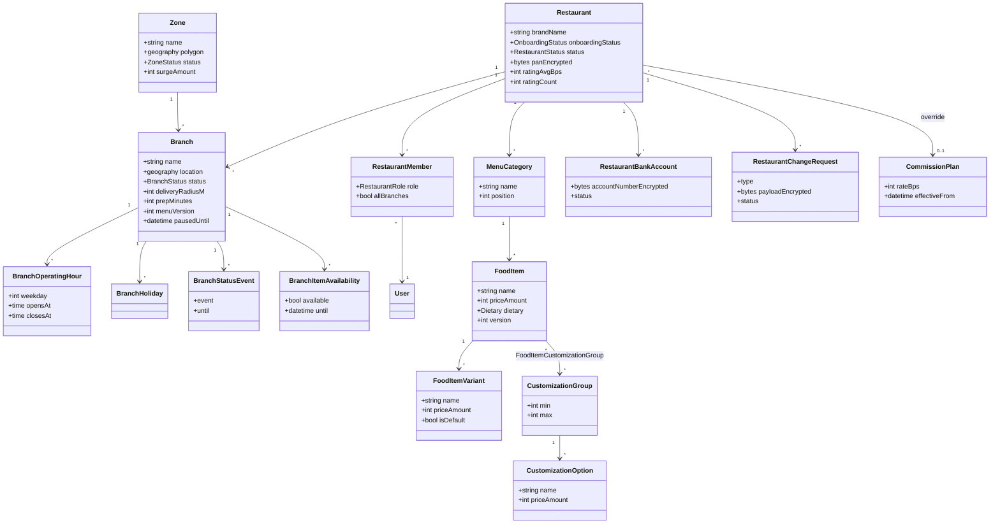
```mermaid
classDiagram
  class Restaurant {
    +string brandName
    +OnboardingStatus onboardingStatus
    +RestaurantStatus status
    +bytes panEncrypted
    +int ratingAvgBps
    +int ratingCount
  }
  class Branch {
    +string name
    +geography location
    +BranchStatus status
    +int deliveryRadiusM
    +int prepMinutes
    +int menuVersion
    +datetime pausedUntil
  }
  class Zone {
    +string name
    +geography polygon
    +ZoneStatus status
    +int surgeAmount
  }
  class RestaurantMember {
    +RestaurantRole role
    +bool allBranches
  }
  class BranchOperatingHour {
    +int weekday
    +time opensAt
    +time closesAt
  }
  class BranchHoliday
  class BranchStatusEvent {
    +event
    +until
  }
  class MenuCategory {
    +string name
    +int position
  }
  class FoodItem {
    +string name
    +int priceAmount
    +Dietary dietary
    +int version
  }
  class FoodItemVariant {
    +string name
    +int priceAmount
    +bool isDefault
  }
  class CustomizationGroup {
    +int min
    +int max
  }
  class CustomizationOption {
    +string name
    +int priceAmount
  }
  class BranchItemAvailability {
    +bool available
    +datetime until
  }
  class RestaurantBankAccount {
    +bytes accountNumberEncrypted
    +status
  }
  class RestaurantChangeRequest {
    +type
    +bytes payloadEncrypted
    +status
  }
  class CommissionPlan {
    +int rateBps
    +datetime effectiveFrom
  }

  Restaurant "1" --> "*" Branch
  Zone "1" --> "*" Branch
  Restaurant "1" --> "*" RestaurantMember
  RestaurantMember "*" --> "1" User
  Branch "1" --> "*" BranchOperatingHour
  Branch "1" --> "*" BranchHoliday
  Branch "1" --> "*" BranchStatusEvent
  Restaurant "1" --> "*" MenuCategory
  MenuCategory "1" --> "*" FoodItem
  FoodItem "1" --> "*" FoodItemVariant
  FoodItem "*" --> "*" CustomizationGroup : FoodItemCustomizationGroup
  CustomizationGroup "1" --> "*" CustomizationOption
  Branch "1" --> "*" BranchItemAvailability
  Restaurant "1" --> "*" RestaurantBankAccount
  Restaurant "1" --> "*" RestaurantChangeRequest
  Restaurant "*" --> "0..1" CommissionPlan : override
```

### 4.3 Cart, checkout and orders

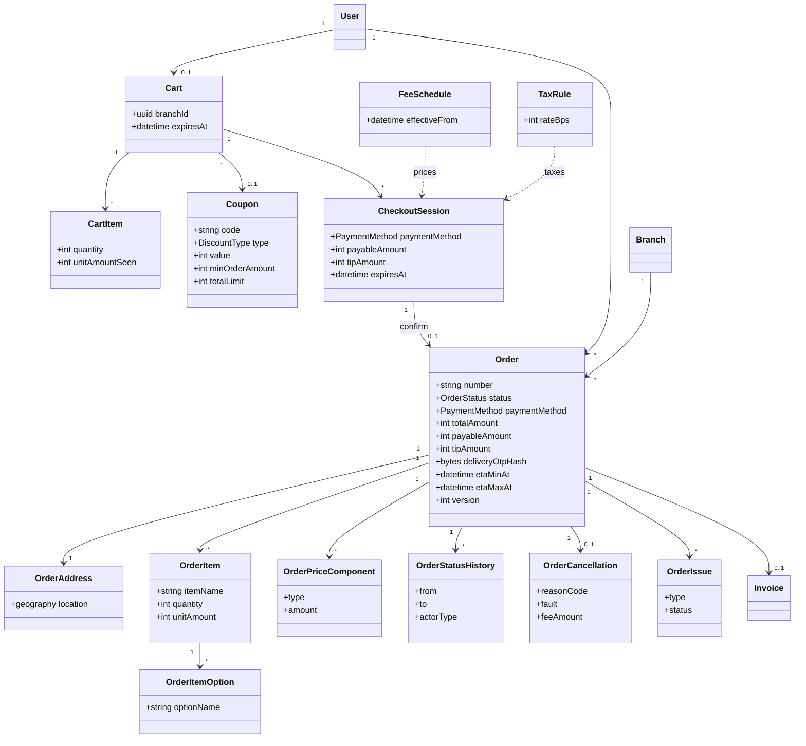
```mermaid
classDiagram
  class Cart {
    +uuid branchId
    +datetime expiresAt
  }
  class CartItem {
    +int quantity
    +int unitAmountSeen
  }
  class Coupon {
    +string code
    +DiscountType type
    +int value
    +int minOrderAmount
    +int totalLimit
  }
  class CheckoutSession {
    +PaymentMethod paymentMethod
    +int payableAmount
    +int tipAmount
    +datetime expiresAt
  }
  class FeeSchedule {
    +datetime effectiveFrom
  }
  class TaxRule {
    +int rateBps
  }
  class Order {
    +string number
    +OrderStatus status
    +PaymentMethod paymentMethod
    +int totalAmount
    +int payableAmount
    +int tipAmount
    +bytes deliveryOtpHash
    +datetime etaMinAt
    +datetime etaMaxAt
    +int version
  }
  class OrderAddress {
    +geography location
  }
  class OrderItem {
    +string itemName
    +int quantity
    +int unitAmount
  }
  class OrderItemOption {
    +string optionName
  }
  class OrderPriceComponent {
    +type
    +amount
  }
  class OrderStatusHistory {
    +from
    +to
    +actorType
  }
  class OrderCancellation {
    +reasonCode
    +fault
    +feeAmount
  }
  class OrderIssue {
    +type
    +status
  }
  class Invoice

  User "1" --> "0..1" Cart
  Cart "1" --> "*" CartItem
  Cart "*" --> "0..1" Coupon
  Cart "1" --> "*" CheckoutSession
  CheckoutSession "1" --> "0..1" Order : confirm
  FeeSchedule ..> CheckoutSession : prices
  TaxRule ..> CheckoutSession : taxes
  User "1" --> "*" Order
  Branch "1" --> "*" Order
  Order "1" --> "1" OrderAddress
  Order "1" --> "*" OrderItem
  OrderItem "1" --> "*" OrderItemOption
  Order "1" --> "*" OrderPriceComponent
  Order "1" --> "*" OrderStatusHistory
  Order "1" --> "0..1" OrderCancellation
  Order "1" --> "*" OrderIssue
  Order "1" --> "0..1" Invoice
```

### 4.4 Payments, ledger and payouts

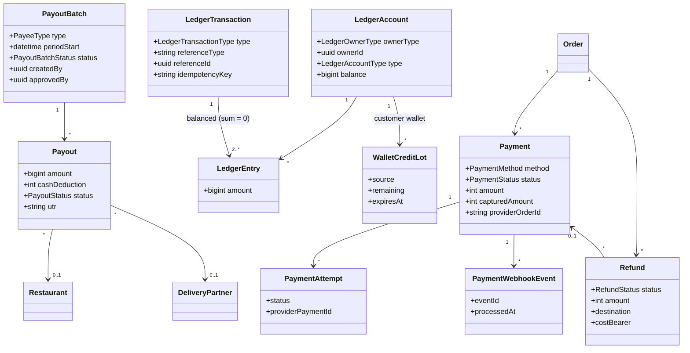
```mermaid
classDiagram
  class Payment {
    +PaymentMethod method
    +PaymentStatus status
    +int amount
    +int capturedAmount
    +string providerOrderId
  }
  class PaymentAttempt {
    +status
    +providerPaymentId
  }
  class PaymentWebhookEvent {
    +eventId
    +processedAt
  }
  class Refund {
    +RefundStatus status
    +int amount
    +destination
    +costBearer
  }
  class LedgerAccount {
    +LedgerOwnerType ownerType
    +uuid ownerId
    +LedgerAccountType type
    +bigint balance
  }
  class LedgerTransaction {
    +LedgerTransactionType type
    +string referenceType
    +uuid referenceId
    +string idempotencyKey
  }
  class LedgerEntry {
    +bigint amount
  }
  class WalletCreditLot {
    +source
    +remaining
    +expiresAt
  }
  class PayoutBatch {
    +PayeeType type
    +datetime periodStart
    +PayoutBatchStatus status
    +uuid createdBy
    +uuid approvedBy
  }
  class Payout {
    +bigint amount
    +int cashDeduction
    +PayoutStatus status
    +string utr
  }

  Order "1" --> "*" Payment
  Payment "1" --> "*" PaymentAttempt
  Payment "1" --> "*" PaymentWebhookEvent
  Order "1" --> "*" Refund
  Payment "0..1" <-- "*" Refund
  LedgerTransaction "1" --> "2..*" LedgerEntry : balanced (sum = 0)
  LedgerAccount "1" --> "*" LedgerEntry
  LedgerAccount "1" --> "*" WalletCreditLot : customer wallet
  PayoutBatch "1" --> "*" Payout
  Payout "*" --> "0..1" Restaurant
  Payout "*" --> "0..1" DeliveryPartner
```

### 4.5 Delivery partners and deliveries

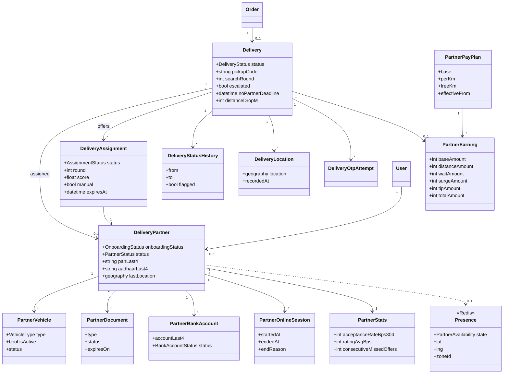
```mermaid
classDiagram
  class DeliveryPartner {
    +OnboardingStatus onboardingStatus
    +PartnerStatus status
    +string panLast4
    +string aadhaarLast4
    +geography lastLocation
  }
  class PartnerVehicle {
    +VehicleType type
    +bool isActive
    +status
  }
  class PartnerDocument {
    +type
    +status
    +expiresOn
  }
  class PartnerBankAccount {
    +accountLast4
    +BankAccountStatus status
  }
  class PartnerOnlineSession {
    +startedAt
    +endedAt
    +endReason
  }
  class PartnerStats {
    +int acceptanceRateBps30d
    +int ratingAvgBps
    +int consecutiveMissedOffers
  }
  class Presence {
    <<Redis>>
    +PartnerAvailability state
    +lat
    +lng
    +zoneId
  }
  class Delivery {
    +DeliveryStatus status
    +string pickupCode
    +int searchRound
    +bool escalated
    +datetime noPartnerDeadline
    +int distanceDropM
  }
  class DeliveryAssignment {
    +AssignmentStatus status
    +int round
    +float score
    +bool manual
    +datetime expiresAt
  }
  class DeliveryStatusHistory {
    +from
    +to
    +bool flagged
  }
  class DeliveryLocation {
    +geography location
    +recordedAt
  }
  class DeliveryOtpAttempt
  class PartnerPayPlan {
    +base
    +perKm
    +freeKm
    +effectiveFrom
  }
  class PartnerEarning {
    +int baseAmount
    +int distanceAmount
    +int waitAmount
    +int surgeAmount
    +int tipAmount
    +int totalAmount
  }

  User "1" --> "0..1" DeliveryPartner
  DeliveryPartner "1" --> "*" PartnerVehicle
  DeliveryPartner "1" --> "*" PartnerDocument
  DeliveryPartner "1" --> "*" PartnerBankAccount
  DeliveryPartner "1" --> "*" PartnerOnlineSession
  DeliveryPartner "1" --> "1" PartnerStats
  DeliveryPartner "1" ..> "0..1" Presence
  Order "1" --> "0..1" Delivery
  Delivery "*" --> "0..1" DeliveryPartner : assigned
  Delivery "1" --> "*" DeliveryAssignment : offers
  DeliveryAssignment "*" --> "1" DeliveryPartner
  Delivery "1" --> "*" DeliveryStatusHistory
  Delivery "1" --> "*" DeliveryLocation
  Delivery "1" --> "*" DeliveryOtpAttempt
  Delivery "1" --> "0..1" PartnerEarning
  PartnerPayPlan "1" --> "*" PartnerEarning
```

### 4.6 Engagement, support and platform

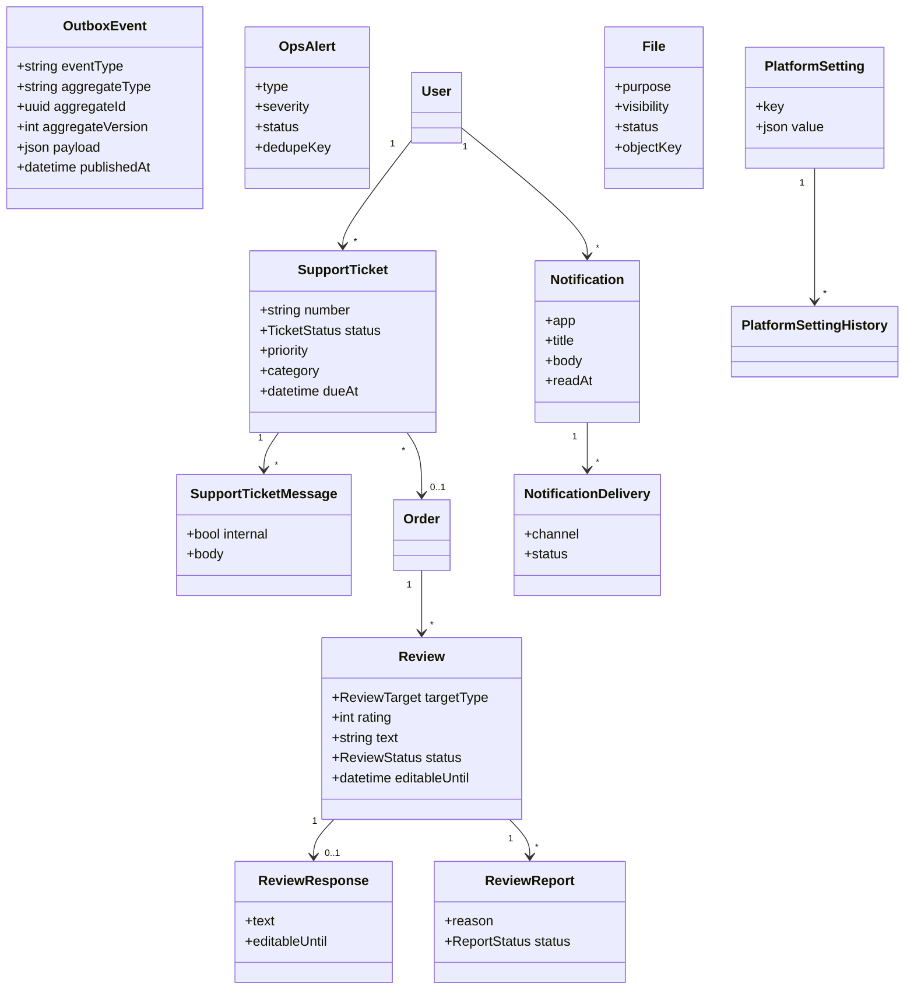
```mermaid
classDiagram
  class Review {
    +ReviewTarget targetType
    +int rating
    +string text
    +ReviewStatus status
    +datetime editableUntil
  }
  class ReviewResponse {
    +text
    +editableUntil
  }
  class ReviewReport {
    +reason
    +ReportStatus status
  }
  class SupportTicket {
    +string number
    +TicketStatus status
    +priority
    +category
    +datetime dueAt
  }
  class SupportTicketMessage {
    +bool internal
    +body
  }
  class Notification {
    +app
    +title
    +body
    +readAt
  }
  class NotificationDelivery {
    +channel
    +status
  }
  class OutboxEvent {
    +string eventType
    +string aggregateType
    +uuid aggregateId
    +int aggregateVersion
    +json payload
    +datetime publishedAt
  }
  class OpsAlert {
    +type
    +severity
    +status
    +dedupeKey
  }
  class PlatformSetting {
    +key
    +json value
  }
  class PlatformSettingHistory
  class File {
    +purpose
    +visibility
    +status
    +objectKey
  }

  Order "1" --> "*" Review
  Review "1" --> "0..1" ReviewResponse
  Review "1" --> "*" ReviewReport
  User "1" --> "*" SupportTicket
  SupportTicket "1" --> "*" SupportTicketMessage
  SupportTicket "*" --> "0..1" Order
  User "1" --> "*" Notification
  Notification "1" --> "*" NotificationDelivery
  PlatformSetting "1" --> "*" PlatformSettingHistory
```

---

## 5. State machine diagrams

### 5.1 Order (SRS §10.3, transitions T01–T16)

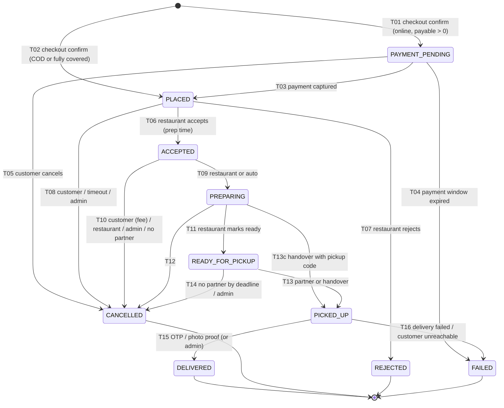
```mermaid
stateDiagram-v2
  [*] --> PAYMENT_PENDING : T01 checkout confirm (online, payable > 0)
  [*] --> PLACED : T02 checkout confirm (COD or fully covered)
  PAYMENT_PENDING --> PLACED : T03 payment captured
  PAYMENT_PENDING --> FAILED : T04 payment window expired
  PAYMENT_PENDING --> CANCELLED : T05 customer cancels
  PLACED --> ACCEPTED : T06 restaurant accepts (prep time)
  PLACED --> REJECTED : T07 restaurant rejects
  PLACED --> CANCELLED : T08 customer / timeout / admin
  ACCEPTED --> PREPARING : T09 restaurant or auto
  ACCEPTED --> CANCELLED : T10 customer (fee) / restaurant / admin / no partner
  PREPARING --> READY_FOR_PICKUP : T11 restaurant marks ready
  PREPARING --> CANCELLED : T12
  PREPARING --> PICKED_UP : T13c handover with pickup code
  READY_FOR_PICKUP --> PICKED_UP : T13 partner or handover
  READY_FOR_PICKUP --> CANCELLED : T14 no partner by deadline / admin
  PICKED_UP --> DELIVERED : T15 OTP / photo proof (or admin)
  PICKED_UP --> FAILED : T16 delivery failed / customer unreachable
  DELIVERED --> [*]
  CANCELLED --> [*]
  REJECTED --> [*]
  FAILED --> [*]
```

### 5.2 Delivery (SRS §12.1, D01–D10)

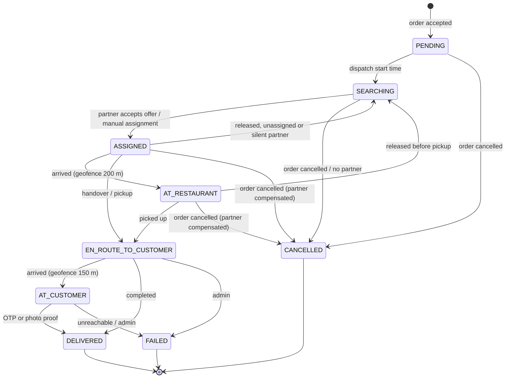
```mermaid
stateDiagram-v2
  [*] --> PENDING : order accepted
  PENDING --> SEARCHING : dispatch start time
  SEARCHING --> ASSIGNED : partner accepts offer / manual assignment
  ASSIGNED --> SEARCHING : released, unassigned or silent partner
  AT_RESTAURANT --> SEARCHING : released before pickup
  ASSIGNED --> AT_RESTAURANT : arrived (geofence 200 m)
  ASSIGNED --> EN_ROUTE_TO_CUSTOMER : handover / pickup
  AT_RESTAURANT --> EN_ROUTE_TO_CUSTOMER : picked up
  EN_ROUTE_TO_CUSTOMER --> AT_CUSTOMER : arrived (geofence 150 m)
  EN_ROUTE_TO_CUSTOMER --> DELIVERED : completed
  AT_CUSTOMER --> DELIVERED : OTP or photo proof
  EN_ROUTE_TO_CUSTOMER --> FAILED : admin
  AT_CUSTOMER --> FAILED : unreachable / admin
  PENDING --> CANCELLED : order cancelled
  SEARCHING --> CANCELLED : order cancelled / no partner
  ASSIGNED --> CANCELLED : order cancelled (partner compensated)
  AT_RESTAURANT --> CANCELLED : order cancelled (partner compensated)
  DELIVERED --> [*]
  FAILED --> [*]
  CANCELLED --> [*]
```

### 5.3 Delivery offer (assignment)

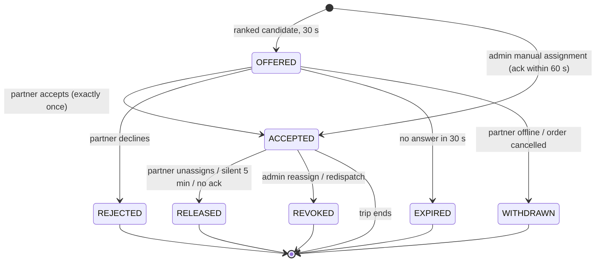
```mermaid
stateDiagram-v2
  [*] --> OFFERED : ranked candidate, 30 s
  OFFERED --> ACCEPTED : partner accepts (exactly once)
  OFFERED --> REJECTED : partner declines
  OFFERED --> EXPIRED : no answer in 30 s
  OFFERED --> WITHDRAWN : partner offline / order cancelled
  [*] --> ACCEPTED : admin manual assignment (ack within 60 s)
  ACCEPTED --> RELEASED : partner unassigns / silent 5 min / no ack
  ACCEPTED --> REVOKED : admin reassign / redispatch
  ACCEPTED --> [*] : trip ends
  REJECTED --> [*]
  EXPIRED --> [*]
  WITHDRAWN --> [*]
  RELEASED --> [*]
  REVOKED --> [*]
```

### 5.4 Payment

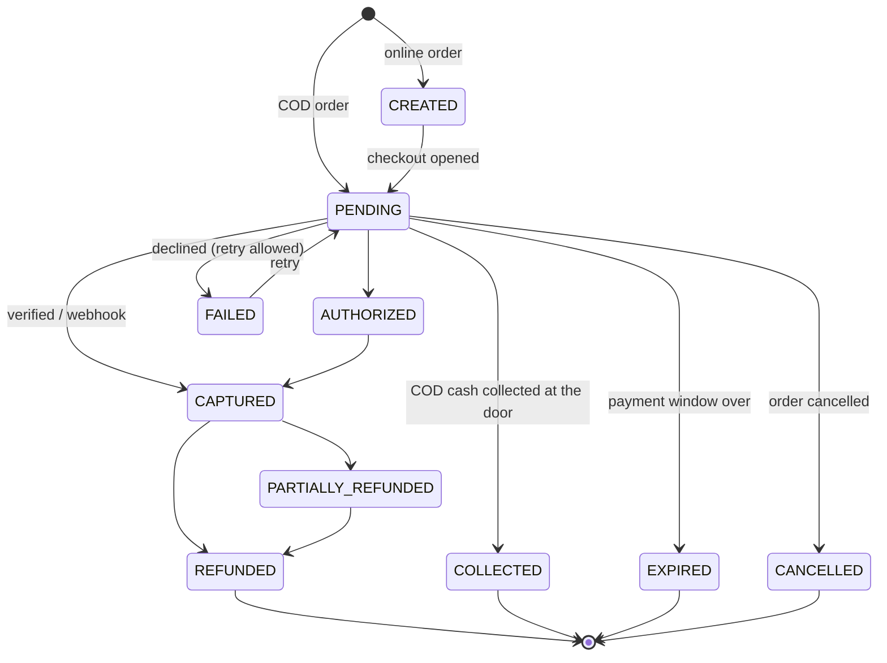
```mermaid
stateDiagram-v2
  [*] --> CREATED : online order
  [*] --> PENDING : COD order
  CREATED --> PENDING : checkout opened
  PENDING --> AUTHORIZED
  PENDING --> CAPTURED : verified / webhook
  AUTHORIZED --> CAPTURED
  PENDING --> FAILED : declined (retry allowed)
  FAILED --> PENDING : retry
  PENDING --> EXPIRED : payment window over
  PENDING --> CANCELLED : order cancelled
  PENDING --> COLLECTED : COD cash collected at the door
  CAPTURED --> PARTIALLY_REFUNDED
  CAPTURED --> REFUNDED
  PARTIALLY_REFUNDED --> REFUNDED
  REFUNDED --> [*]
  COLLECTED --> [*]
  EXPIRED --> [*]
  CANCELLED --> [*]
```

### 5.5 Refund

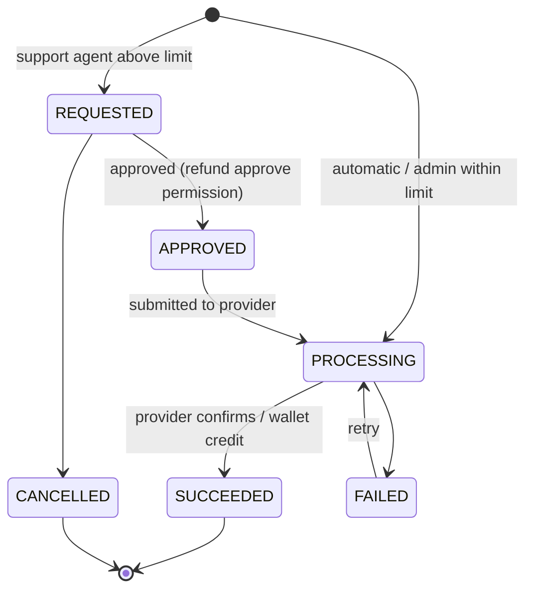
```mermaid
stateDiagram-v2
  [*] --> REQUESTED : support agent above limit
  [*] --> PROCESSING : automatic / admin within limit
  REQUESTED --> APPROVED : approved (refund approve permission)
  REQUESTED --> CANCELLED
  APPROVED --> PROCESSING : submitted to provider
  PROCESSING --> SUCCEEDED : provider confirms / wallet credit
  PROCESSING --> FAILED
  FAILED --> PROCESSING : retry
  SUCCEEDED --> [*]
  CANCELLED --> [*]
```

### 5.6 Partner availability (Redis presence)

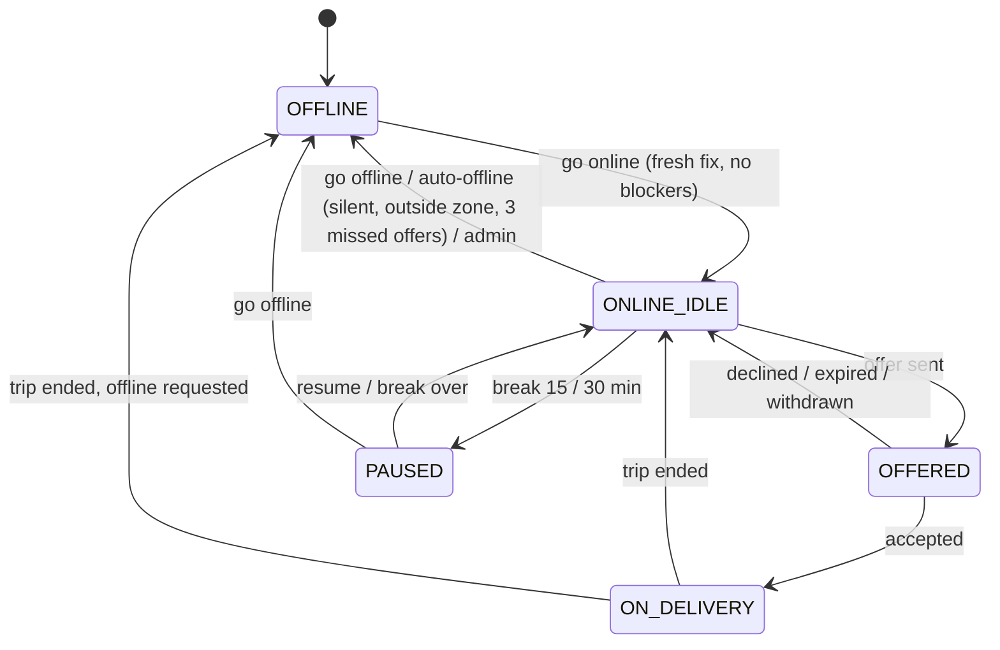
```mermaid
stateDiagram-v2
  [*] --> OFFLINE
  OFFLINE --> ONLINE_IDLE : go online (fresh fix, no blockers)
  ONLINE_IDLE --> OFFERED : offer sent
  OFFERED --> ONLINE_IDLE : declined / expired / withdrawn
  OFFERED --> ON_DELIVERY : accepted
  ON_DELIVERY --> ONLINE_IDLE : trip ended
  ON_DELIVERY --> OFFLINE : trip ended, offline requested
  ONLINE_IDLE --> PAUSED : break 15 / 30 min
  PAUSED --> ONLINE_IDLE : resume / break over
  ONLINE_IDLE --> OFFLINE : go offline / auto-offline (silent, outside zone, 3 missed offers) / admin
  PAUSED --> OFFLINE : go offline
```

### 5.7 Restaurant / partner onboarding

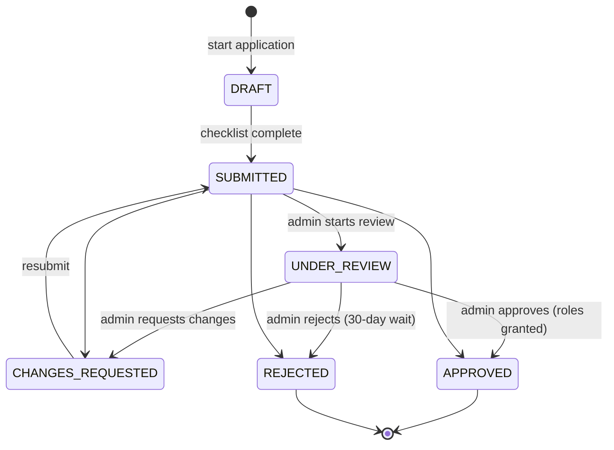
```mermaid
stateDiagram-v2
  [*] --> DRAFT : start application
  DRAFT --> SUBMITTED : checklist complete
  SUBMITTED --> UNDER_REVIEW : admin starts review
  UNDER_REVIEW --> CHANGES_REQUESTED : admin requests changes
  SUBMITTED --> CHANGES_REQUESTED
  CHANGES_REQUESTED --> SUBMITTED : resubmit
  UNDER_REVIEW --> APPROVED : admin approves (roles granted)
  UNDER_REVIEW --> REJECTED : admin rejects (30-day wait)
  SUBMITTED --> APPROVED
  SUBMITTED --> REJECTED
  APPROVED --> [*]
  REJECTED --> [*]
```

### 5.8 Support ticket

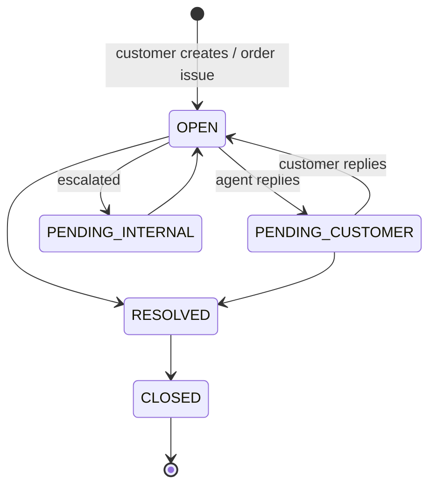
```mermaid
stateDiagram-v2
  [*] --> OPEN : customer creates / order issue
  OPEN --> PENDING_CUSTOMER : agent replies
  PENDING_CUSTOMER --> OPEN : customer replies
  OPEN --> PENDING_INTERNAL : escalated
  PENDING_INTERNAL --> OPEN
  OPEN --> RESOLVED
  PENDING_CUSTOMER --> RESOLVED
  RESOLVED --> CLOSED
  CLOSED --> [*]
```

---

## 6. Sequence diagrams

### 6.1 Place and pay an online order (AC-E2E-001)

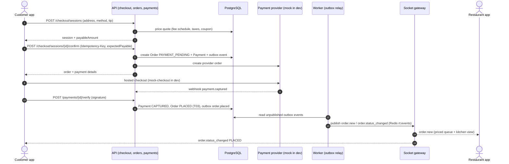
```mermaid
sequenceDiagram
  autonumber
  actor C as Customer app
  participant API as API (checkout, orders, payments)
  participant DB as PostgreSQL
  participant P as Payment provider (mock in dev)
  participant W as Worker (outbox relay)
  participant RT as Socket gateway
  actor R as Restaurant app

  C->>API: POST /checkout/sessions (address, method, tip)
  API->>DB: price quote (fee schedule, taxes, coupon)
  API-->>C: session + payableAmount
  C->>API: POST /checkout/sessions/{id}/confirm (Idempotency-Key, expectedPayable)
  API->>DB: create Order PAYMENT_PENDING + Payment + outbox event
  API->>P: create provider order
  API-->>C: order + payment details
  C->>P: hosted checkout (mock-checkout in dev)
  P-->>API: webhook payment.captured
  C->>API: POST /payments/{id}/verify (signature)
  API->>DB: Payment CAPTURED, Order PLACED (T03), outbox order.placed
  W->>DB: read unpublished outbox events
  W->>RT: publish order.new / order.status_changed (Redis rt:events)
  RT-->>R: order.new (priced queue + kitchen view)
  RT-->>C: order.status_changed PLACED
```

### 6.2 Dispatch: sequential offers and exactly-once acceptance (FR-DISP)

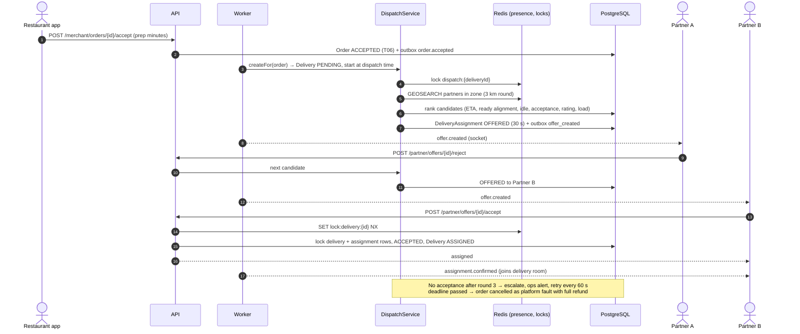
```mermaid
sequenceDiagram
  autonumber
  actor R as Restaurant app
  participant API as API
  participant W as Worker
  participant D as DispatchService
  participant Redis as Redis (presence, locks)
  participant DB as PostgreSQL
  actor P1 as Partner A
  actor P2 as Partner B

  R->>API: POST /merchant/orders/{id}/accept (prep minutes)
  API->>DB: Order ACCEPTED (T06) + outbox order.accepted
  W->>D: createFor(order) → Delivery PENDING, start at dispatch time
  D->>Redis: lock dispatch:{deliveryId}
  D->>Redis: GEOSEARCH partners in zone (3 km round)
  D->>DB: rank candidates (ETA, ready alignment, idle, acceptance, rating, load)
  D->>DB: DeliveryAssignment OFFERED (30 s) + outbox offer_created
  W-->>P1: offer.created (socket)
  P1->>API: POST /partner/offers/{id}/reject
  API->>D: next candidate
  D->>DB: OFFERED to Partner B
  W-->>P2: offer.created
  P2->>API: POST /partner/offers/{id}/accept
  API->>Redis: SET lock:delivery:{id} NX
  API->>DB: lock delivery + assignment rows, ACCEPTED, Delivery ASSIGNED
  API-->>P2: assigned
  W-->>P2: assignment.confirmed (joins delivery room)
  Note over D,DB: No acceptance after round 3 → escalate, ops alert, retry every 60 s<br/>deadline passed → order cancelled as platform fault with full refund
```

### 6.3 Trip completion with OTP and COD (AC-E2E-003)

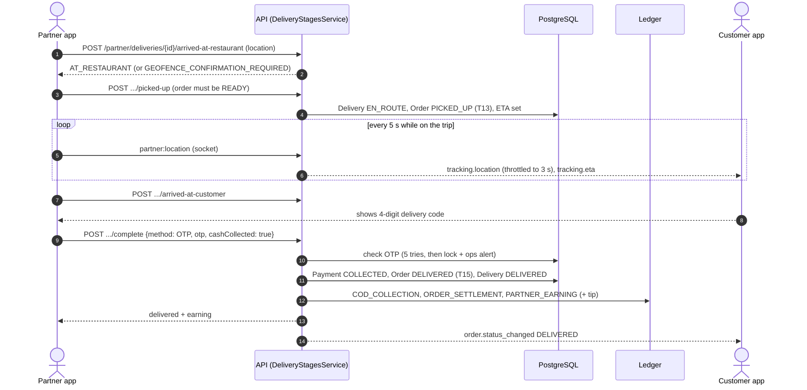
```mermaid
sequenceDiagram
  autonumber
  actor P as Partner app
  participant API as API (DeliveryStagesService)
  participant DB as PostgreSQL
  participant L as Ledger
  actor C as Customer app

  P->>API: POST /partner/deliveries/{id}/arrived-at-restaurant (location)
  API-->>P: AT_RESTAURANT (or GEOFENCE_CONFIRMATION_REQUIRED)
  P->>API: POST .../picked-up (order must be READY)
  API->>DB: Delivery EN_ROUTE, Order PICKED_UP (T13), ETA set
  loop every 5 s while on the trip
    P->>API: partner:location (socket)
    API-->>C: tracking.location (throttled to 3 s), tracking.eta
  end
  P->>API: POST .../arrived-at-customer
  C-->>P: shows 4-digit delivery code
  P->>API: POST .../complete {method: OTP, otp, cashCollected: true}
  API->>DB: check OTP (5 tries, then lock + ops alert)
  API->>DB: Payment COLLECTED, Order DELIVERED (T15), Delivery DELIVERED
  API->>L: COD_COLLECTION, ORDER_SETTLEMENT, PARTNER_EARNING (+ tip)
  API-->>P: delivered + earning
  API-->>C: order.status_changed DELIVERED
```

### 6.4 Realtime push through the outbox (SRS §13)

```mermaid
sequenceDiagram
  autonumber
  participant S as Domain service (API)
  participant DB as PostgreSQL
  participant W as Worker: outbox relay (leader)
  participant Pr as Realtime projections
  participant Redis as Redis pub/sub
  participant G as Socket gateway (every API instance)
  actor U as Client app

  S->>DB: BEGIN state change + INSERT outbox_events COMMIT
  W->>DB: SELECT unpublished events (ordered)
  W->>Pr: handlers per event type (orders, deliveries, payments...)
  Pr->>Redis: PUBLISH rt:events {namespace, rooms, event, envelope}
  Redis-->>G: message
  G-->>U: emit to rooms (eventId, aggregate version, data)
  W->>DB: mark event published
  U->>U: drop duplicates (eventId) and older versions
  Note over U: On reconnect: re-subscribe and refetch REST snapshots
```

### 6.5 Sign-in with refresh-token rotation and theft detection (AC-E2E-009)

```mermaid
sequenceDiagram
  autonumber
  actor B as Browser tab
  participant API as API (auth)
  participant DB as PostgreSQL
  participant Redis as Redis

  B->>API: POST /auth/otp/login (phone, code)
  API->>DB: verify OTP, create session + refresh token
  API-->>B: access token (15 min) + HttpOnly refresh cookie
  B->>API: POST /auth/refresh (cookie)
  API->>DB: rotate: mark old token used, issue successor
  API->>Redis: keep successor for the grace window (encrypted with the old token)
  API-->>B: new access token + new cookie
  Note over B,API: Same old cookie again within 10 s (page navigation race) → same successor returned
  actor T as Attacker (stolen old cookie)
  T->>API: POST /auth/refresh (old cookie, after the grace window)
  API->>DB: reuse detected → revoke the whole session
  API-->>T: 401 AUTH_REFRESH_REUSED
  API->>Redis: publish session.revoked (rt:control) → sockets disconnected
  B->>API: next request → 401 → signed out on every tab
```

### 6.6 Admin refund with support limit (FR-ADMIN-051)

```mermaid
sequenceDiagram
  autonumber
  actor S as Support agent
  actor A as Admin
  participant API as API (admin finance)
  participant RF as RefundService
  participant L as Ledger
  participant P as Payment provider

  S->>API: POST /admin/orders/{id}/refunds (amount, reason, requestApproval)
  API->>API: check refundable amount and per-order support limit
  alt within the limit
    API->>RF: create + submit
    RF->>P: refund to source (or credit wallet)
    RF->>L: REFUND posting
    API-->>S: PROCESSING / SUCCEEDED
  else above the limit
    API->>RF: create REQUESTED
    API-->>S: needs approval
    A->>API: POST /admin/refunds/{id}/approve (reason)
    API->>RF: submit
    RF->>P: refund
  end
  Note over API: Every action is audited (HIGH sensitivity with the reason)
```

---

## 7. Activity diagram — checkout

```mermaid
flowchart TD
  Start([Customer opens cart]) --> Loc{Delivery location<br/>serviceable?}
  Loc -- No --> NoServ[Show: outside our area] --> End1([Stop])
  Loc -- Yes --> Open{Restaurant<br/>accepting orders?}
  Open -- No --> Closed[Show: Closed now · opens at …] --> End1
  Open -- Yes --> Min{Above minimum<br/>order?}
  Min -- No --> AddMore[Ask to add items] --> Start
  Min -- Yes --> Coupon{Coupon applied?}
  Coupon -- Yes --> Valid{Coupon valid?}
  Valid -- No --> CouponErr[Show reason, remove coupon] --> Session
  Valid -- Yes --> Session
  Coupon -- No --> Session[Create checkout session<br/>price quote: items, fees, taxes, discount, tip]
  Session --> Method{Payment method}
  Method -- COD --> CodOk{COD allowed?<br/>cap, not blocked}
  CodOk -- No --> Method
  CodOk -- Yes --> Confirm
  Method -- Online / wallet --> Confirm[Confirm with Idempotency-Key<br/>and expected payable]
  Confirm --> Changed{Price changed or<br/>session expired?}
  Changed -- Yes --> Session
  Changed -- No --> Placed{Payable > 0<br/>and online?}
  Placed -- No --> OrderPlaced([Order PLACED → restaurant notified])
  Placed -- Yes --> Pay[Pay with provider]
  Pay --> PayOk{Captured?}
  PayOk -- No --> Retry{Retry within<br/>payment window?}
  Retry -- Yes --> Pay
  Retry -- No --> Expired([Order FAILED: payment expired])
  PayOk -- Yes --> OrderPlaced
```
